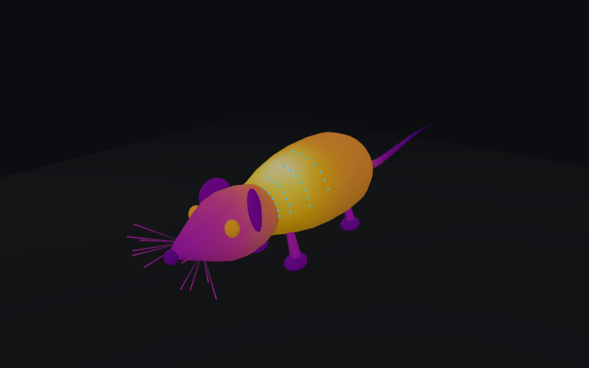

# 3D Thermal Mouse

An interactive 3D mouse in the browser, shown as a thermal camera would see it, that responds to room temperature, a floor pad and local heat.

**Live demo:** https://lea7570.github.io/3d_thermal_mouse/



> **Educational model only.** The thermal field is synthetic and physiologically inspired. It is **not** real sensor data. The blood-pressure figure is a heuristic, not a validated measurement. Do not use this for research or clinical conclusions.

## What you can explore

- **Thermal and visible views.** A procedural 3D mouse colored with an ironbow palette (20-40 °C), or in natural fur and skin colors.
- **Room temperature (15-34 °C).** Drives vasomotor thermoregulation. In the cold the periphery vasoconstricts, so the tail, ears, nose and paws cool. Above about 30 °C (the mouse thermoneutral zone) it vasodilates and the periphery warms toward the core. Standard housing (about 20-26 °C) is mildly cold-stressing for a mouse.
- **Brown fat (BAT).** An interscapular hotspot that gets hotter and wider in the cold (non-shivering thermogenesis) and quiets near thermoneutrality.
- **Floor pad: off, heating or cooling.** Warms or cools the parts that touch the floor: the belly and paws.
- **Thermal inertia.** Temperatures ease toward their new equilibrium instead of jumping.
- **Heat pulses.** Click or tap the mouse in thermal view to add a pulse of heat that spreads and fades over about 45 s.
- **Measure region.** Drag a circle to get the min, average and max of the visible surface inside it, like a thermal camera ROI. Up to 3 regions at once, marked with colored dots on the model.
- **Tail-cuff BP estimate.** An illustrative blood-pressure value with a low-confidence warning when the tail is cold. This is why real tail-cuff protocols warm the animal first.
- **Live readouts.** BAT hotspot temperature, thermogenesis level, and the average temperatures of the ears, nose, paws and tail tip.

### What to try

Drag the room slider from cold to warm and watch the tail light up as the BAT hotspot fades. Example readings from the simulator:

| Readout | Colder room | Warmer room |
|---|---|---|
| Tail tip | 17.9 °C at 15 °C | 26.4 °C at 32 °C |
| BAT hotspot | ~38 °C at 22 °C | ~35 °C at 32 °C |
| BP estimate | ~151 mmHg (cold, low confidence) | ~127 mmHg (warm) |

## Controls

| Action | Desktop | Touch |
|---|---|---|
| Rotate | Drag | Drag with one finger |
| Zoom | Scroll wheel | Pinch |
| Read temperature | Hover | Tap |
| Add heat pulse (thermal view) | Click the mouse | Tap the mouse |
| Measure a region | Measure region, then drag a circle (Esc cancels) | Measure region, then drag a circle |
| Remove a region | Click × next to it | Tap × next to it |

The control panel also has **Thermal view / Visible view**, **Auto-rotate**, **Clear heat pulses**, the **Floor pad** selector (Off / Heating / Cooling) and the **Room temp** slider. On small screens the panel starts collapsed. Tap **Controls** to open it.

## How the model works

Every vertex of the mesh has a temperature, and the color comes from mapping it to the palette.

1. **Base map per body part.** Each part starts from a set value: fur-covered torso ~33.5 °C (a little warmer underneath), head 32.5 °C cooling toward the muzzle, eyes 35 °C, and cooler extremities (~29 °C). The tail runs from 32 °C at the base to 25 °C at the tip. Small random noise is added.
2. **Vasomotor sensitivity.** Each vertex has a sensitivity (torso ~0.12, rising to 0.8-0.9 at the ears, nose, paws and toes, and toward the tail tip). The room temperature gives one offset: -8 °C at 15 °C, 0 at 30 °C, and about +2.7 °C at 34 °C. Each vertex gets that offset scaled by its sensitivity.
3. **Brown fat.** A Gaussian centered on the interscapular region of the torso. Its amplitude and width grow as the room gets colder (+1 °C at 30 °C and above, about +6.4 °C at 15 °C).
4. **Pad contact.** A floor pad adds up to +4.5 °C (heating) or -4.0 °C (cooling), weighted toward low vertices near the center of the body.
5. **Heat pulses.** Each click adds a Gaussian that widens like diffusion (r² = r0² + 2Dt). Its peak drops as it spreads and decays exponentially with time.
6. **Easing.** The displayed temperature moves exponentially toward the equilibrium (time constant 1.5 s). Real tissue takes minutes; this is sped up so you can watch it.

Region measurement renders the mesh offscreen with each vertex's index encoded as a color. Every pixel inside the circle then names the surface point it sees, so the statistics cover only the visible surface and are weighted by area.

The BP estimate treats the gap between core and tail temperature as a stand-in for vasoconstriction and sympathetic tone. It maps that gap to a range of about 118-160 mmHg and flags low confidence when the tail is cold.

## Run locally

There is no build step and nothing to install. Everything is in `index.html`, which loads Three.js 0.160 from the jsDelivr CDN through an import map.

- Open `index.html` in a modern browser (you need an internet connection for the CDN), or
- Serve the folder with any static server, for example:

  ```sh
  python -m http.server
  ```

  then open http://localhost:8000/.

## Browser support

You need a current desktop or mobile browser with WebGL and import-map support. Region measurement uses a flat-shaded ID pass, which needs WebGL2.

## License

[MIT](LICENSE) © 2026 Lea Axselrod
